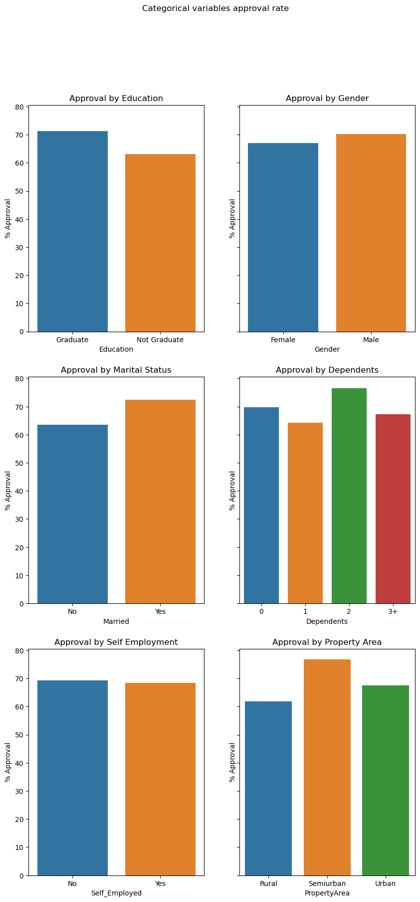
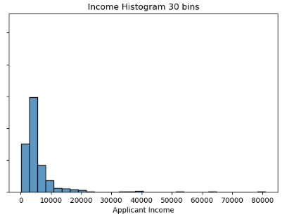
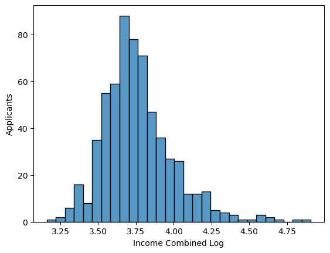

# Mini Project IV - Machine Learning Model Deployment

### [Assignment](assignment.md)

## **Project/Goals**
1. Create a Machine Learning model that predicts if a loan for an applicant will be approved.
2. Implement the model using pipelines.
3. Create an API using Flask and pickle files to predict if the new applicant will get the loan approved.
4. Deploy the API in AWS Cloud and test using Python test file.

## **Hypothesis**

- Married applicants have a better chance of getting a loan.
- Are male applicants more likely to get a loan?
- Applicants with a credit score are more likely to get a loan.
- Applicants with co-applicant are more likely to get a loan.

These could be tested using the means and comparing the datasets.

I compared them using graphs and tables.

## **Process**

### **1. EDA**

- I found null values that were fixed using mean, median and logic according to data values.
- The values for the income and loan amount were skewed. I used the log to get a more normal distribution.

- For more details, go to section 2 of this [notebook](/notebooks/instructions.ipynb).

### **2. Data Cleaning**

- Completed null values with mode for categorical variables such as Gender and Self Employed.
- For other categorical values, the values were completed using the following logic:
    - For Married, all the Null became No.
    - For Dependents, all the Nulls became 0.
    - For Credit History, all the Null became 0.
- For numerical variables:
    - Loan Amount Term I used the mean according to its data distribution.
    - I used the median for Loan Amount because the data was skewed (right-tailed).

- For more details, go to section 3 of this [notebook](notebooks/instructions.ipynb).   

### **3. Feature Engineering**

- Transformation of variables Loan Amount and Combined Income (combination of Applicant and Co-applicant Income) into log values to handle a better distribution.
- Transform categorical variables into dummies for better handling on the ML model.
- For more information, go to section 3 of this [notebook](notebooks/instructions.ipynb). 

- I also implemented pipelines to handle all the transformation in the second part of the project. For more information, go to section 5 of this [notebook](notebooks/instructions.ipynb). 

### **4. Modelling**

- Used Random Forest Classifier as the algorithm for my implementation. 
- The result without running hyperparameter tuning was:
>Accuracy: 72.36%

- I reimplemented all the processes with pipelines

- After running GridSearchCV, I saw these results:
> Best hyperparameters: {'model__criterion': 'log_loss', 'model__max_depth': None, 'model__min_samples_leaf': 3, 'model__min_samples_split': 3, 'model__n_estimators': 10}

> Best accuracy score: 79.67%

### **5. Deployment**

- Deployed in AWS EC2 server.
- Created an app in Flask on the AWS server.
- Created a test file in python to test the implementation.

## Results

- The model implemented with pipelines and optimization got an accuracy of 80.49% in loan approval prediction.

- The implementation of AWS

- Results from Amazon instance

## Challenges 
- I had to change the port on my Flask application because the AWS instance was not responding properly with the default port.

## Future Goals
- Implement another ML model to review if I can get better results.
- Create an interface to interact with the end user.
- Analyze the hypotheses created with more detail.
